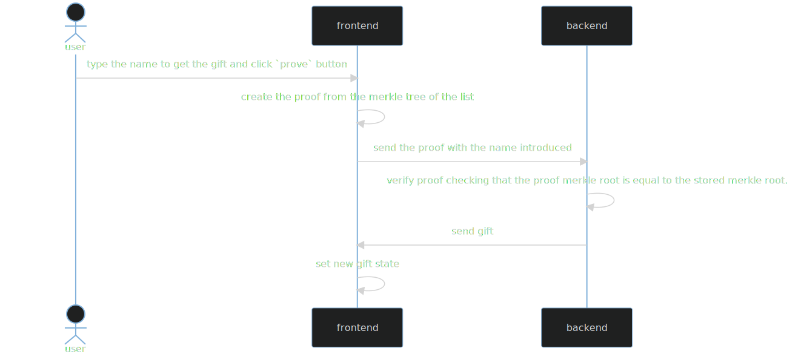

# About
## GiftList

This project is an application which gives out gifts, but only to names [on the list](https://github.com/ChainShot/GiftList/blob/main/utils/niceList.json). The catch is that on the server you are only allowed to store one **32 byte value** in the server memory. This 32 byte value has to be enough for the server to be able to determine who is [on the list](https://github.com/ChainShot/GiftList/blob/main/server/index.js#L10).

The **client** is the **prover** here. They are the ones trying to prove to the server that the one name is in the list. Likewise think of the **server** as the **verifier** here. They are taking the client's proof and, using minimal information, able to verify that the name sent from the client is actually in the list.

## Requirements

- Docker

## Hot to execute
### Steps to create the Nextjs client

1. Go to https://rayniel95.github.io/ecdsa-node/

### Steps to create the node server

1. Install [Docker](https://www.docker.com/)
2. Download the project
3. Open a terminal in the project folder
4. Build the image, execute: `docker build ./ -f Dockerfile-node -t server-node`
5. Run the container, execute: `docker run -it -p 3042:3042 server-node`

## How it works

### Demo

See it on Youtube

### TODO
- [ ] add golang server
- [ ] add rust server
- [ ] add sign the message using custom private key on frontend
- [ ] add a demo
